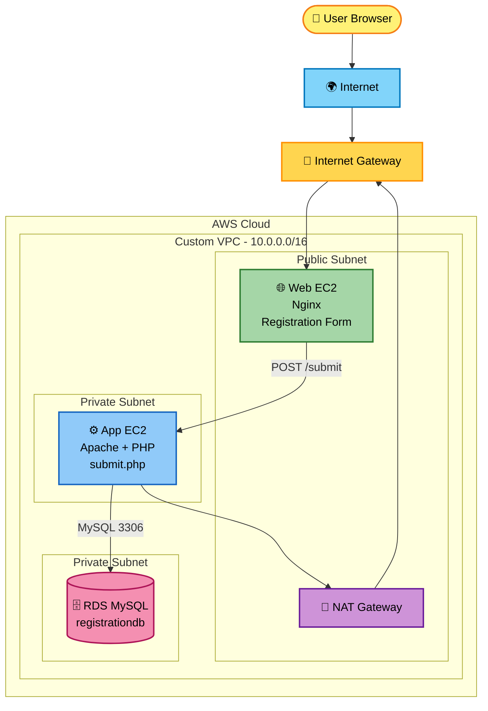

# 🚀 3-Tier Infrastructure Deployment Using Terraform Modules on AWS

<p align="center">
  
  
  
  
  
</p>

---

## 📌 Project Overview

This project demonstrates a complete **3-Tier Web Application Architecture on AWS** using **Terraform Modules**.

The architecture contains:

| Tier | Service | Purpose |
|---|---|---|
| 🌐 Web Tier | EC2 + Nginx | Hosts registration form |
| ⚙️ App Tier | EC2 + Apache + PHP | Handles form submission |
| 🗄️ Database Tier | Amazon RDS MySQL | Stores registration data |

---

## 🎯 Objective

To design and deploy a secure, modular, and automated 3-tier infrastructure on AWS using Terraform.

Main objectives:

- Create custom VPC
- Create public and private subnets across 2 Availability Zones
- Configure Internet Gateway and NAT Gateway
- Launch Web Tier EC2 in public subnet
- Launch App Tier EC2 in private subnet
- Provision RDS MySQL in private subnet
- Use Terraform modules for clean code organization
- Automate server setup using user-data scripts
- Test registration form and database insertion

---

## 🏗️ Architecture Diagram



---

## 🔄 Application Flow

```mermaid
flowchart LR
    A[👤 User opens Web Public IP]:::start
    B[🌐 Nginx Registration Form]:::web
    C[📝 Submit Form]:::form
    D[⚙️ PHP Backend on App Server]:::app
    E[🗄️ Insert Data into RDS MySQL]:::db
    F[✅ Registration Successful]:::success

    A --> B --> C --> D --> E --> F

    classDef start fill:#fff59d,stroke:#fbc02d,stroke-width:2px,color:#000;
    classDef web fill:#a5d6a7,stroke:#2e7d32,stroke-width:2px,color:#000;
    classDef form fill:#ffcc80,stroke:#ef6c00,stroke-width:2px,color:#000;
    classDef app fill:#90caf9,stroke:#1565c0,stroke-width:2px,color:#000;
    classDef db fill:#f48fb1,stroke:#ad1457,stroke-width:2px,color:#000;
    classDef success fill:#c8e6c9,stroke:#1b5e20,stroke-width:2px,color:#000;
```



---

## 🧰 Tools and Technologies Used

| Tool / Service | Use |
|---|---|
| AWS VPC | Custom cloud network |
| Public Subnet | Hosts Web EC2 |
| Private Subnet | Hosts App EC2 and RDS |
| Internet Gateway | Public internet access |
| NAT Gateway | Internet access for private subnet |
| EC2 | Web and App servers |
| Nginx | Web server for registration form |
| Apache | App server |
| PHP | Backend form processing |
| RDS MySQL | Database |
| Terraform | Infrastructure automation |
| Terraform Modules | Code organization |
| GitHub | Version control |

---

## 📁 Project Structure

```text
3-tier-terraform-modules/
│
├── main.tf
├── provider.tf
├── variables.tf
├── outputs.tf
├── security_rules.tf
├── terraform.tfvars.example
├── README.md
├── .gitignore
│
├── modules/
│   ├── vpc/
│   │   ├── main.tf
│   │   ├── variables.tf
│   │   └── outputs.tf
│   │
│   ├── ec2/
│   │   ├── main.tf
│   │   ├── variables.tf
│   │   └── outputs.tf
│   │
│   └── rds/
│       ├── main.tf
│       ├── variables.tf
│       └── outputs.tf
│
├── scripts/
│   ├── web_user_data.sh
│   └── app_user_data.sh
│
└── docs/
    ├── 01-vpc.png
    ├── 02-subnets.png
    ├── 03-ec2-instances.png
    ├── 04-rds-database.png
    ├── 05-registration-form.png
    ├── 06-registration-success.png
    └── 07-terraform-output.png
```

---

## 🌐 Networking Details

| Component | CIDR |
|---|---|
| VPC | 10.0.0.0/16 |
| Public Subnet 1 | 10.0.1.0/24 |
| Public Subnet 2 | 10.0.2.0/24 |
| Private Subnet 1 | 10.0.11.0/24 |
| Private Subnet 2 | 10.0.12.0/24 |

Public subnet route:

```text
0.0.0.0/0 → Internet Gateway
```

Private subnet route:

```text
0.0.0.0/0 → NAT Gateway
```

---

## 🔐 Security Group Design

| Security Group | Inbound Rule |
|---|---|
| Web SG | HTTP 80 from Internet |
| Web SG | HTTPS 443 from Internet |
| App SG | HTTP 80 only from Web SG |
| RDS SG | MySQL 3306 only from App SG |

---

## ⚙️ How It Works

1. User opens Web EC2 public IP.
2. Nginx displays the registration form.
3. User submits name, email, phone, and course.
4. Nginx forwards request to App EC2 private IP.
5. PHP script receives the data.
6. PHP connects to RDS MySQL.
7. Data is inserted into the `registrations` table.
8. User sees registration successful message.

---

## ✅ Prerequisites

Install these before running the project:

- AWS CLI
- Terraform
- Git
- AWS account
- GitHub account

Check versions:

```powershell
aws --version
terraform version
git --version
```

Check AWS login:

```powershell
aws sts get-caller-identity
```

---

## 🚀 Deployment Steps

### 1. Clone Repository

```powershell
git clone https://github.com/Varad-thorat1718/3-Tier-Infrastructure-Deployment-Using-Terraform-Modules-on-AWS.git
cd 3-Tier-Infrastructure-Deployment-Using-Terraform-Modules-on-AWS
```

### 2. Create terraform.tfvars

```powershell
Copy-Item terraform.tfvars.example terraform.tfvars
```

Update password and values in `terraform.tfvars`.

### 3. Initialize Terraform

```powershell
terraform init
```

### 4. Format Code

```powershell
terraform fmt -recursive
```

### 5. Validate Code

```powershell
terraform validate
```

Expected output:

```text
Success! The configuration is valid.
```

### 6. Check Plan

```powershell
terraform plan
```

### 7. Apply Infrastructure

```powershell
terraform apply
```

Type:

```text
yes
```

### 8. Get Outputs

```powershell
terraform output
```

Important output:

```text
web_public_ip
web_public_dns
app_private_ip
db_endpoint
```

---

## 🧪 Testing

Open browser:

```text
http://WEB_PUBLIC_IP
```

Example:

```text
http://13.232.205.217
```

Fill demo data:

```text
Name: Rahul Sharma
Email: rahul.demo@example.com
Phone: 9876543210
Course: AWS DevOps
```

Expected result:

```text
Registration Successful
Your data has been saved in RDS MySQL database.
```

---

## 📸 Screenshots

### VPC


### Subnets


### EC2 Instances


### RDS Database


### Registration Form


### Registration Success


### Terraform Output


---

## 🧹 Cleanup

To avoid AWS charges, destroy resources after demo:

```powershell
terraform destroy
```

Type:

```text
yes
```

---

## 💰 Cost Warning

This project can create chargeable AWS resources:

- NAT Gateway
- RDS MySQL
- EC2
- Elastic IP

Destroy resources when not needed.

---

## 🧠 What I Learned

- Terraform module structure
- AWS VPC networking
- Public and private subnet design
- NAT Gateway and Internet Gateway usage
- EC2 user-data automation
- Nginx reverse proxy setup
- PHP backend deployment
- RDS MySQL private database setup
- Security group tier-based access
- GitHub project documentation

---

## 🎤 Interview Explanation

This project deploys a 3-tier AWS architecture using Terraform modules. The Web Tier is public and runs Nginx, the App Tier is private and runs Apache with PHP, and the Database Tier uses private RDS MySQL. The Web Tier forwards form submissions to the App Tier, and the App Tier inserts data into RDS. Security groups ensure that users can access only the Web Tier, while App and Database tiers remain private.

---

## ❓ Common Interview Questions

### What is 3-tier architecture?

It separates the application into Web Tier, Application Tier, and Database Tier.

### Why use Terraform modules?

Modules make Terraform code reusable, clean, and easy to manage.

### Why is Web Tier public?

Users need to access the website from the internet.

### Why is App Tier private?

The backend should not be directly exposed to users.

### Why is RDS private?

Database should be protected from public internet access.

### Why use NAT Gateway?

Private instances need internet access for updates and package installation.

### How is the database secured?

RDS is private and allows MySQL traffic only from the App Tier security group.

---

## 🚀 Future Improvements

- Add Application Load Balancer
- Add Auto Scaling Group
- Add HTTPS using ACM
- Add Route 53 domain
- Use AWS Secrets Manager for DB password
- Add CloudWatch monitoring
- Add GitHub Actions CI/CD
- Add S3 backend and DynamoDB state locking
- Add Ansible playbooks

---

## 📌 Repository

```text
https://github.com/Varad-thorat1718/3-Tier-Infrastructure-Deployment-Using-Terraform-Modules-on-AWS
```

---

## ✅ Project Status

```text
Implementation: Completed
Testing: Completed
Documentation: Completed
GitHub Push: Ready
```

---

<p align="center">
  <b>⭐ 3-Tier AWS Infrastructure Project using Terraform Modules ⭐</b>
</p>
